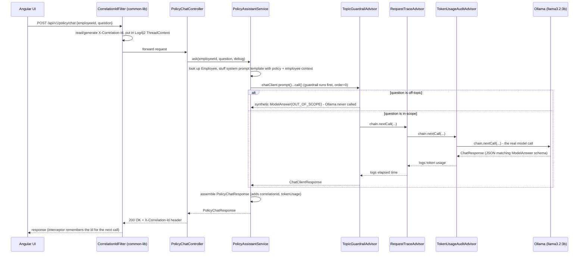

# Architecture

## Layers

```
┌─────────────────────────────────────────────────────────────────┐
│ Angular frontend (frontend/)                                    │
│   features/ (policy-chat, employee-selector) → core/services/   │
│   → HttpClient (+ correlation-id interceptor)                   │
└───────────────────────────────┬───────────────────────────────────┘
                                 │ HTTP (JSON)
┌───────────────────────────────▼───────────────────────────────────┐
│ employee-support-app (backend/employee-support-app)              │
│                                                                   │
│  controller/   PolicyChatController, EmployeeController          │
│  service/      PolicyAssistantService, EmployeeDirectoryService  │
│  advisor/      TopicGuardrailAdvisor, TokenUsageAuditAdvisor,     │
│                RequestTraceAdvisor (defaults) + DebugEchoAdvisor  │
│                (per-request only)                                │
│  config/       ChatClientConfig, ChatModelProperties, WebConfig  │
│  model/        Employee, PolicyChatRequest/Response, ModelAnswer │
│                                                                   │
│  depends on ↓                                                    │
├───────────────────────────────────────────────────────────────────┤
│ common-lib (backend/common-lib) - reusable jar                   │
│   exception/  ApplicationException, ErrorCode, ErrorResponse,     │
│               GlobalExceptionHandler (@RestControllerAdvice)      │
│   logging/    CorrelationIdFilter, CorrelationIdConstants         │
└───────────────────────────────┬───────────────────────────────────┘
                                 │ spring-ai-starter-model-ollama
┌───────────────────────────────▼───────────────────────────────────┐
│ Ollama (runs on the host machine, not in a container)             │
└─────────────────────────────────────────────────────────────────┘
```

`common-lib` is a separate Maven module (packaging `jar`) so its exception handling and
correlation-id/logging support could be reused by a second Spring Boot service later without
copy-pasting code — it depends on nothing from `employee-support-app`.

## Request flow (one policy question)



Key points:
- **Guardrail runs first** (`getOrder() == 0`) and can short-circuit the whole chain — no Ollama
  call, no token cost, near-instant response — before `RequestTraceAdvisor` or
  `TokenUsageAuditAdvisor` even see the request.
- **DebugEchoAdvisor** is not in this diagram because it's not a default: `PolicyAssistantService`
  only adds it to the per-request advisor list when the controller is called with `?debug=true`.
- **Structured output**: the model is only ever asked to produce `ModelAnswer` (`answer`,
  `category`) — never asked to invent `correlationId` or `tokenUsage`, which
  `PolicyAssistantService` fills in itself from request-scoped state.

## Configuration model

- `ChatModelProperties` (`app.chat.*`) owns the app-level knobs: `model`, `temperature`,
  `max-tokens`, `min-tokens`. It validates `max-tokens >= min-tokens` at startup
  (`@PostConstruct`), so a bad `.env` fails fast instead of silently misbehaving.
- `spring.ai.ollama.*` owns the actual model connection (base URL, model name) — driven by the
  same `OLLAMA_BASE_URL` / `OLLAMA_MODEL` environment variables so there's one source of truth.
- `ChatClientConfig` combines both into the shared `ChatClient` bean's `defaultOptions` (built
  via the **portable** `org.springframework.ai.chat.prompt.ChatOptions` builder — no
  Ollama-specific or OpenAI-specific type is referenced), and its `defaultAdvisors`.

## Why no RAG / no database

The five policy areas fit comfortably in one system prompt (~500 words) and the "employee
directory" is five records — a vector store or SQL database would add operational complexity
with no benefit at this scale. `EmployeeDirectoryService` and the `.st` template are the two
places to swap in a database and a retrieval step respectively, if the scope grows.
